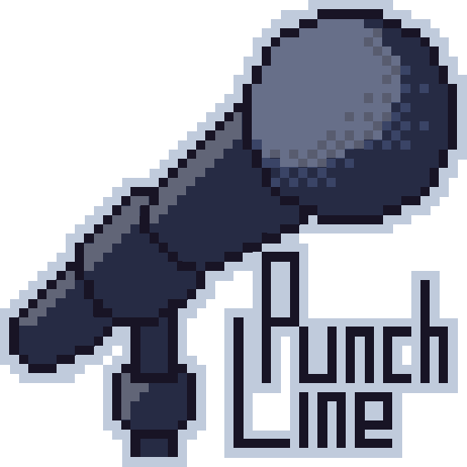

[![MIT License][license-shield]][license-url]
[![Issues][issues-shield]][issues-url]
[![Downloads][downloads-shield]][downloads-url]
[![Stars][stars-shield]][stars-url]\
[![Unity][unity-shield]][unity-url]
[![C#][csharp-shield]][csharp-url]
[![Visual Studio][vs-shield]][vs-url]

 

  
   
  <h1>Punchline!</h1>
  
  <i>Punchline!</i> is our entry for the <a href="https://ldjam.com/events/ludum-dare/53">Ludum Dare 53</a> game jam, about the theme <b>delivery</b>. 
  We made the whole game using Unity game engine and we created each asset (models, sprites, vfx and sfx) by ourselves.
  
  <i>Punchline!</i> is a game where an amateur comedian tries to tell his best joke. You're going to play 3 minigames in quick succession: the first two are <i>setup</i> games, where you’ll have to "fight" to keep the audience as engaged as possible and score points; finally, in the third minigame, it will be time to <i><b>deliver the punchline</b></i>!
  
  <a href="https://ldjam.com/events/ludum-dare/53/punchline">Jam Entry</a>
  ·
  <a href="https://ldjam.com/events/ludum-dare/53/stats">Jam Stats</a>
  ·
  <a href="https://github.com/NataliumGames/LudumDare53/releases/latest">Latest Release</a>
  

## Demo

## Play the Game

<!--
## Roadmap
- [x] mobile version
- [x] dodging walls colliders
- [ ] adjust stage fixing minigame
- [ ] add laughters or booing at the end of the game
- [ ] settings / (improved) info pages
- [ ] score usage
-->

## Team

<table>
  <!--<tr align="center"><td colspan="3"><b>Team BCR</b></td></tr>-->
  <tr align="center">
    <td></td>
    <td></td>
    <td></td>
    <td></td>
  </tr>
  <tr align="center">
    <td><b>Federico Andrucci</b></td>
    <td><b>Alex Gianelli</b></td>
    <td><b>Gabriele Marconi</b></td>
    <td><b>Michele Righi</b></td>
  </tr>
  <tr align="center">
    <td>
      
      
    </td>
    <td>
      
      
    </td>
    <td>
      
      
    </td>
    <td>
      
      
      
    </td>
  </tr>
</table>

[unity-shield]: https://img.shields.io/badge/Unity-000000?logo=unity&logoColor=white
[unity-url]: https://unity.com/
[csharp-shield]: https://img.shields.io/badge/C%23-%23239120.svg?logo=c-sharp&logoColor=white
[csharp-url]: https://docs.microsoft.com/en-us/dotnet/csharp/
[vs-shield]: https://img.shields.io/badge/Visual%20Studio-5C2D91.svg?logo=visual-studio-code&logoColor=white
[vs-url]: https://visualstudio.microsoft.com/
[downloads-shield]: https://img.shields.io/github/downloads/NataliumGames/LudumDare53/total
[downloads-url]: https://github.com/NataliumGames/LudumDare53/releases/latest
[license-shield]: https://img.shields.io/github/license/iss2022-BCR/WasteService
[license-url]: https://github.com/NataliumGames/LudumDare53/blob/main/LICENSE
[issues-shield]: https://img.shields.io/github/issues/NataliumGames/LudumDare53
[issues-url]: https://github.com/NataliumGames/LudumDare53/issues
[stars-shield]: https://custom-icon-badges.herokuapp.com/github/stars/NataliumGames/LudumDare53?logo=star&logoColor=yellow
[stars-url]: https://github.com/NataliumGames/LudumDare53/stargazers
